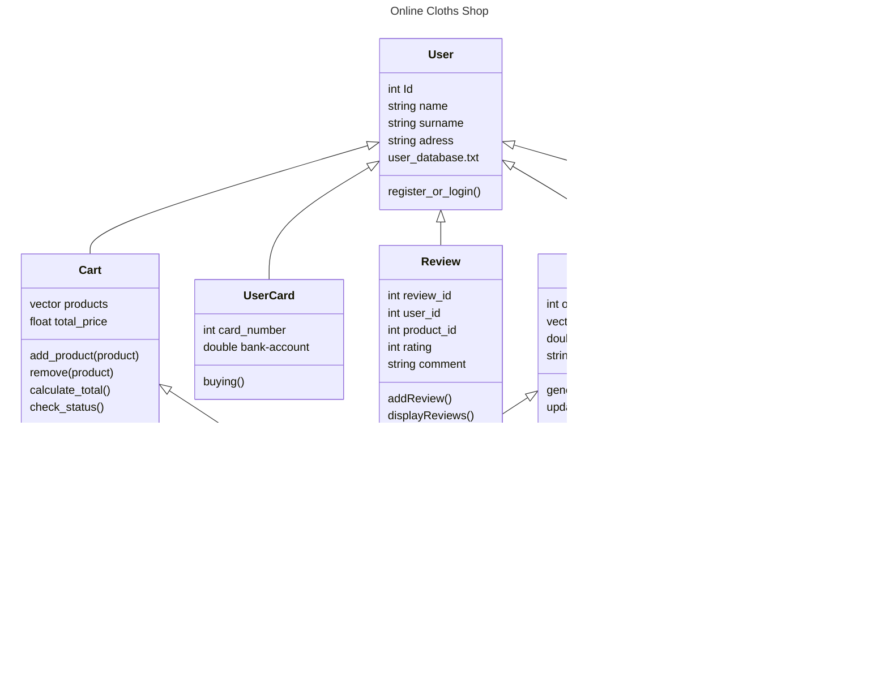

```mermaid

---
title: Online Cloths Shop
---
classDiagram
    class User
    User : int Id
    User : string name
    User : string surname
    User : string adress
    User : register_or_login()
    User : user_database.txt
    
    class Product
    Product : int product_id
    Product : string product_name
    Product : string product_description
    Product : string product_category
    Product : string product_gender
    Product : float product_prise
    Product : display_info()
    Product : product_database.txt
    
    class Cart
    Cart : vector <product> products
    Cart : float total_price
    Cart : add_product(product)
    Cart : remove(product)
    Cart : calculate_total()
    Cart : check_status()

    class UserCard
    UserCard : int card_number
    UserCard : double bank-account
    UserCard : buying()

    class Warehouse
    Warehouse : vector <Product> products
    Warehouse : update_Warehouse()
    
    class Review
    Review : int review_id
    Review : int user_id
    Review : int product_id
    Review : int rating
    Review : string comment
    Review : addReview()
    Review : displayReviews()

    class Order
    Order : int order_id
    Order : vector <Product> products
    Order : double total_price
    Order : string order_status
    Order : generate_order_details()
    Order : update_order_status()

    class Payment 
    Payment : string payment_type
    Payment : int amount
    Payment : process_payment()
    Payment : validate_transaction()
    Payment : issue_receipt()

    class Admin
    Admin : manage_products()
    Admin : manage_users()
    Admin : view_orders()
    Admin : update_Warehouse()

    Cart <|-- Warehouse
    Cart <|-- Product
    User <|-- Cart
    User <|-- UserCard
    User <|-- Review
    User <|-- Order
    User <|-- Admin
    Order <|-- Payment
    Order <|-- Product

```