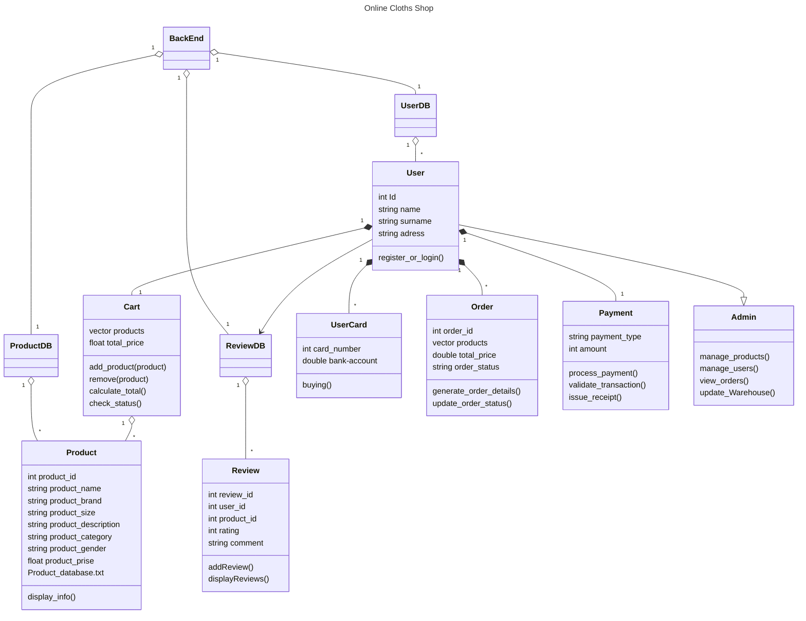

```mermaid

---
title: Online Cloths Shop
---
classDiagram

    class BackEnd
    class UserDB
    class ProductDB
    class ReviewDB

    class User
    User : int Id
    User : string name
    User : string surname
    User : string adress
    User : register_or_login()

    
    class Product
    Product : int product_id
    Product : string product_name
    Product : string product_brand
    Product : string product_size
    Product : string product_description
    Product : string product_category
    Product : string product_gender
    Product : float product_prise
    Product : display_info()
    Product : Product_database.txt
    
    class Cart
    Cart : vector <product> products
    Cart : float total_price
    Cart : add_product(product)
    Cart : remove(product)
    Cart : calculate_total()
    Cart : check_status()

    class UserCard
    UserCard : int card_number
    UserCard : double bank-account
    UserCard : buying()

    
    class Review
    Review : int review_id
    Review : int user_id
    Review : int product_id
    Review : int rating
    Review : string comment
    Review : addReview()
    Review : displayReviews()

    class Order
    Order : int order_id
    Order : vector <Product> products
    Order : double total_price
    Order : string order_status
    Order : generate_order_details()
    Order : update_order_status()

    class Payment 
    Payment : string payment_type
    Payment : int amount
    Payment : process_payment()
    Payment : validate_transaction()
    Payment : issue_receipt()

    class Admin
    Admin : manage_products()
    Admin : manage_users()
    Admin : view_orders()
    Admin : update_Warehouse()

    
    Cart "1" o-- "*" Product
    User "1" *-- "1" Cart
    User "1" *-- "*" UserCard
    User --> ReviewDB
    User "1" *-- "*" Order
    User --|> Admin
    User "1" *-- "1" Payment
    UserDB "1" o-- "*" User
    ProductDB "1" o-- "*" Product
    ReviewDB "1" o-- "*" Review
    BackEnd "1" o--  "1" UserDB
    BackEnd "1" o--  "1" ReviewDB
    BackEnd "1" o--  "1" ProductDB

```